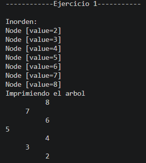
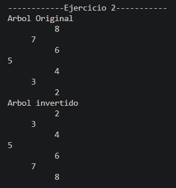
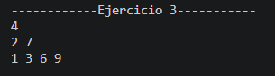
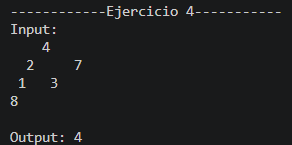

# Informe de Ejercicios de Árboles Binarios en Java

## Datos informativos

**Nombre:** Sebastian Muñoz  
**Universidad:** Universidad Politécnica Salesiana
**Asignatura:** Estructura de Datos  
**Tema:** Árboles binarios en Java  

---

## Introducción

En este informe se presentan cuatro ejercicios desarrollados en Java utilizando árboles binarios. Para la implementación se trabajó con la clase `Node`, que representa cada nodo del árbol, y con la clase `BinaryTree`, que permite insertar valores y organizar los datos siguiendo la lógica de un árbol binario de búsqueda.

El objetivo de estos ejercicios fue practicar operaciones importantes dentro de los árboles, como la inserción de datos, impresión de la estructura, inversión del árbol, recorrido por niveles y cálculo de profundidad máxima.

---

## Ejercicio 1: Inserción e impresión de un árbol binario

### Descripción

En este ejercicio se crea un árbol binario de enteros a partir de un arreglo de números. Cada número se inserta dentro del árbol usando el método `add()` de la clase `BinaryTree`. Después de insertar los valores, el programa muestra el recorrido inorden y también imprime el árbol de forma visual en consola.

### Elementos utilizados

- Clase `BinaryTree<Integer>`
- Clase `Node<Integer>`
- Arreglos de enteros
- Recorrido inorden
- Recursividad
- Método `printTree`

### Explicación del código

En este ejercicio lo que hice fue recibir un arreglo de números y crear un árbol binario de tipo `Integer`. Luego recorrí el arreglo con un ciclo `for each`, insertando cada número dentro del árbol con el método `add()`.

Después de insertar los datos, imprimí el recorrido inorden, ya que en un árbol binario de búsqueda este recorrido permite mostrar los valores ordenados de menor a mayor. También agregué un método llamado `printTree`, que sirve para mostrar el árbol de una forma más visual en la consola.

La impresión del árbol se realiza con recursividad. Primero se imprime el lado derecho del árbol, luego se muestra el valor del nodo actual con espacios según el nivel en el que se encuentre, y finalmente se imprime el lado izquierdo. De esta manera, el árbol se puede visualizar de forma lateral.

### Código del ejercicio

```java
package structures.trees;

import structures.node.Node;

public class Ejercicio1 {
    public void insert(int[] numeros) {
        BinaryTree<Integer> arbol = new BinaryTree<>();

        for (int numero : numeros) {
            arbol.add(numero);
        }

        System.out.println("\n------------Ejercicio 1-----------");
        System.out.println("\nInorden: ");
        arbol.inOrden();

        printTree(arbol.getRoot());
    }

    public void printTree(Node<Integer> root) {
        System.out.println("Imprimiendo el arbol");
        printTreeRecursivo(root, 0);
    }

    private void printTreeRecursivo(Node<Integer> actual, int nivel) {
        if (actual == null)
            return;

        printTreeRecursivo(actual.getRight(), nivel + 1);

        for (int i = 0; i < nivel; i++) {
            System.out.print("     ");
        }

        System.out.println(actual.getValue());
        printTreeRecursivo(actual.getLeft(), nivel + 1);
    }
}
``` 

### Captura de la ejecución



---

## Ejercicio 2: Inversión de un árbol binario

### Descripción

En este ejercicio se invierte un árbol binario. Esto significa que los hijos izquierdos pasan a ser hijos derechos y los hijos derechos pasan a ser hijos izquierdos. Antes de realizar la inversión, el programa imprime el árbol original, y después muestra el árbol invertido.

### Elementos utilizados

- Clase `Node<Integer>`
- Referencias `left` y `right`
- Recursividad
- Intercambio de nodos
- Método `printTree`

### Explicación del código

En este ejercicio trabajé con la raíz de un árbol ya creado. Primero imprimí el árbol original para poder ver cómo estaba organizado antes de modificarlo. Luego utilicé el método `invertirRecursivo`, que se encarga de recorrer cada nodo del árbol.

Dentro del método recursivo, primero verifico si el nodo actual es `null`. Si es así, se termina esa llamada recursiva. Si el nodo existe, guardo temporalmente el hijo izquierdo en una variable llamada `x`. Después cambio el hijo izquierdo por el hijo derecho y el hijo derecho por el valor guardado en `x`.

Finalmente, el mismo proceso se aplica de forma recursiva al subárbol izquierdo y al subárbol derecho. Así se logra invertir todo el árbol, no solo la raíz.

### Código del ejercicio

```java
package structures.trees;

import structures.node.Node;

public class Ejercicio2 {
    public void invertTree(Node<Integer> root) {
        System.out.println("\n------------Ejercicio 2-----------");

        System.out.println("Arbol Original");
        printTree(root);

        invertirRecursivo(root);

        System.out.println("Arbol invertido");
        printTree(root);
    }

    private void invertirRecursivo(Node<Integer> actual) {
        if (actual == null)
            return;

        Node<Integer> x = actual.getLeft();

        actual.setLeft(actual.getRight());
        actual.setRight(x);

        invertirRecursivo(actual.getLeft());
        invertirRecursivo(actual.getRight());
    }

    public void printTree(Node<Integer> root) {
        printTreeRecursivo(root, 0);
    }

    private void printTreeRecursivo(Node<Integer> actual, int nivel) {
        if (actual == null)
            return;

        printTreeRecursivo(actual.getRight(), nivel + 1);

        for (int i = 0; i < nivel; i++)
            System.out.print("     ");

        System.out.println(actual.getValue());

        printTreeRecursivo(actual.getLeft(), nivel + 1);
    }
}
```

### Captura de la ejecución



---

## Ejercicio 3: Listado de nodos por niveles

### Descripción

En este ejercicio se obtiene una lista de listas, donde cada lista interna contiene los nodos que pertenecen a un mismo nivel del árbol. Para resolverlo se utiliza una cola, ya que permite recorrer el árbol por niveles desde la raíz hacia abajo.

### Elementos utilizados

- Clase `Node<Integer>`
- `List`
- `ArrayList`
- `LinkedList`
- `Queue`
- Recorrido por niveles
- Estructura FIFO

### Explicación del código

En este ejercicio implementé el método `listLevels`, que recibe como parámetro la raíz del árbol. Primero creo una lista llamada `niveles`, donde se van a guardar los nodos separados por nivel.

Si la raíz es `null`, significa que el árbol está vacío, por lo tanto se retorna la lista vacía. Si el árbol tiene datos, agrego la raíz a una cola. La cola permite trabajar con el orden FIFO, es decir, el primer nodo que entra es el primero en salir.

Mientras la cola no esté vacía, guardo la cantidad de nodos que existen en el nivel actual. Luego creo una lista llamada `nivelActual`, donde se agregan los nodos de ese nivel. Por cada nodo que se saca de la cola, se revisa si tiene hijo izquierdo o derecho. Si existen, se agregan a la cola para procesarlos en el siguiente nivel.

Al final de cada vuelta, la lista del nivel actual se agrega a la lista principal `niveles`. De esta forma, el resultado queda organizado por niveles del árbol.

### Código del ejercicio

```java
package structures.trees;

import java.util.ArrayList;
import java.util.LinkedList;
import java.util.List;
import java.util.Queue;
import structures.node.Node;

public class Ejercicio3 {

    public List<List<Node<Integer>>> listLevels(Node<Integer> root) {
        List<List<Node<Integer>>> niveles = new ArrayList<>();

        if (root == null) {
            return niveles;
        }

        Queue<Node<Integer>> cola = new LinkedList<>();
        cola.add(root);

        while (!cola.isEmpty()) {
            int cantidadNivel = cola.size();
            List<Node<Integer>> nivelActual = new LinkedList<>();

            for (int i = 0; i < cantidadNivel; i++) {
                Node<Integer> actual = cola.poll();

                nivelActual.add(actual);

                if (actual.getLeft() != null) {
                    cola.add(actual.getLeft());
                }

                if (actual.getRight() != null) {
                    cola.add(actual.getRight());
                }
            }

            niveles.add(nivelActual);
        }

        return niveles;
    }
}
```

### Captura de la ejecución



---

## Ejercicio 4: Profundidad máxima de un árbol binario

### Descripción

En este ejercicio se calcula la profundidad máxima de un árbol binario. La profundidad representa la cantidad máxima de niveles que existen desde la raíz hasta el nodo más lejano del árbol.

### Elementos utilizados

- Clase `Node<Integer>`
- Recursividad
- Método `maxDepth`
- Comparación con `Math.max`
- Subárbol izquierdo y subárbol derecho

### Explicación del código

En este ejercicio implementé el método `maxDepth`, que recibe la raíz del árbol. La lógica principal es recorrer el árbol de forma recursiva para calcular cuántos niveles tiene.

Primero se verifica si el nodo recibido es `null`. Si es así, se retorna `0`, porque no hay ningún nivel que contar. Si el nodo existe, se calcula la profundidad del lado izquierdo y la profundidad del lado derecho llamando nuevamente al mismo método.

Luego se utiliza `Math.max` para comparar cuál de los dos lados tiene mayor profundidad. Al resultado se le suma `1`, porque también se debe contar el nodo actual. De esta manera, el método devuelve la profundidad máxima del árbol completo.

### Código del ejercicio

```java
package structures.trees;

import structures.node.Node;

public class Ejercicio4 {

    public int maxDepth(Node<Integer> root) {
        if (root == null) {
            return 0;
        }

        int profundidadIzquierda = maxDepth(root.getLeft());
        int profundidadDerecha = maxDepth(root.getRight());

        return Math.max(profundidadIzquierda, profundidadDerecha) + 1;
    }
}
```

### Captura de la ejecución



---

## Clase principal: App

---

En la clase `App` tengo el método `main`, que es desde donde inicia la ejecución del programa. Desde ahí llamo a los métodos que me permiten probar las diferentes partes del proyecto. En este caso, el método más importante es `runEjercicios()`, porque dentro de él voy ejecutando los cuatro ejercicios realizados.

Primero creo un objeto de la clase `Ejercicio1` y también declaro un arreglo de números enteros. Ese arreglo se envía al método `insert`, donde se crea un árbol binario, se insertan los valores y luego se muestra el recorrido inorden junto con la impresión del árbol en consola.

Después ejecuto el `Ejercicio2`. Para este ejercicio creo otro arreglo de números y los inserto en un nuevo árbol binario llamado `arbol`. Luego obtengo la raíz con el método `getRoot()` y se la paso al método `invertTree`, que se encarga de invertir el árbol cambiando los hijos izquierdos por los derechos.

En el `Ejercicio3` creo otro árbol llamado `arbolEjercicio3`. Hice esto para no usar el mismo árbol del ejercicio anterior, porque ese ya fue invertido. Luego inserto los valores del arreglo `numeros3` y llamo al método `listLevels`, que me devuelve los nodos separados por niveles. Al final recorro esas listas usando ciclos `for` para imprimir cada nivel en una línea diferente.

Finalmente, en el `Ejercicio4` creo un árbol manualmente usando objetos de tipo `Node<Integer>`. En este caso no uso el método `add()`, porque necesitaba formar una estructura específica como la del ejemplo del ejercicio. Después llamo al método `maxDepth`, que calcula la profundidad máxima del árbol. Por último, imprimo la entrada del árbol y el resultado obtenido.
